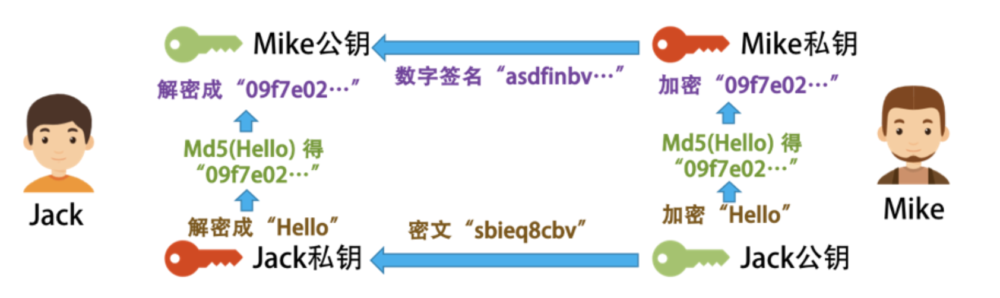
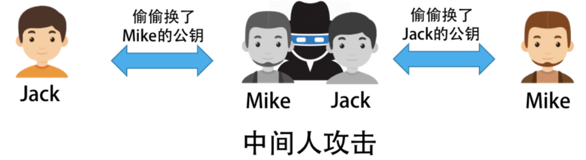

# **2 区块链技术细节（哈希算法/加密和挖矿)**

## **1 哈希算法**

对于计算机来说，区块链就像一个单向链表，一个数据块中保存着三个信息。

* 真正的数据。
* 自己的地址（或是 ID）。
* 前一个数据块的地址。

这样，通过追溯前一个块的地址，把所有的数据块存成了一条链。所以，我们叫其 BlockChain。如下图所示。


**每个数据块的 " 地址 " 的编码使用了计算机上的一个算法，计算机圈内人士把这个算法叫 Secure Hash**。

有人音译为 " 安全哈希 "，也有人意译为 " 安全散列 "。在计算机应用中，hash 算法主要有几个功能。

* 用来生成唯一标识一个数据块的 ID（身份证），这个 ID 几乎不能重复。
* 用来做数据的特征码。只要数据中一个 bit 的数据出现更改，那么整个 hash 值就完全不一样了。而且数据学上保证了，我们无法通过 hash 值反推回原数据。

于是，很多公司在互联网上发布信息或软件的时候，都会带上一个 Checksum（校验码）。你只要把整个文件的数据传入到那个特定的 hash 算法中，就会得到一串很长的字符串。如果和官方发布的 Checksum 字符串不一样，那么就说明信息或文件内容被人更改或是信息残缺了。因此，也被应用在 " 数字签名 " 中。

在计算机世界里，有两个很著名的 hash 算法，一个叫 MD5（Wikipedia 链接），一个叫 SHA-2（Wikipedia 链接）， 区块链用的是 SHA-256 这个算法。

**下面是一个示例。**

* 对 "chen hao" 这个信息计算 MD5 值得到 9824df83b2d35172ef5eb63a47a878eb（一个 16 进制数）。
* 如果对 “chen hao" 做一个字符的修改，将字母 "o" 改成数字 "0”，即 “chen ha0”，计算出来的 MD5 值就成了 d521ce0616359df7e16b20486b78d2a8。可以看到，这和之前的 MD5 值完全不一样了。

于是，我们就可以利用 hash 算法的这个特性来对数据做 " 数字签名 "。也就是说，我将 " 数据 " 和其 " 签名 "（hash 计算值）一起发布，这样可以让收到方来验证数据有没有被修改。

我们再来看上面那个区块链的图。


对于第一块数据，我们把其 " 数据集 " 和 " 前数据块的 hash 值 00000a6cba" 一起做 hash 值，得到本区块的地址 000007cabfa。然后，下一个区块会把自己的数据和 000007cabfa 一起做 hash，得到 000008acbed 这个哈希值……如此往复下去。

根据 " 被 hash 的数据中有一个 bit 被修改了，整个 hash 就完全不一样了 " 这个特性，我们知道：

* 如果前置数据块中的数据改了，那么其 hash 就会完全不一样了，也就是说你的 ID 或地址就变了，于是别人就找不到这个数据块了；
* 所以，你还要去修改别人数据块中指向你的地址，但是别人数据块中指向你的地址（ID/hash）变了，也会导致他自己的地址（ID/hash）随之变化。因为他用你的地址生成了自己的地址，这样一来，你就需要把其他人的地址全部改掉。

在这样的连锁反应下，你想要偷偷修改一个 bit 的难度一下就提高很多。所以，在区块链的世界里，越老的区块越安全也越不容易被人篡改，越新的区块越不安全也越容易被人篡改。

### **1-1 比特币的 hash 算法**

下面我来简单介绍一下，比特币中区块链的一些细节。下图是区块链的协议格式。


**其中 Version，Previous Block Hash，Merkle Root，Timestamp，Difficulty Target 和 Nonce 这六个数据字段是区块链的区块数据协议头**。

后面的数据是交易数据，分别是：本块中的交易笔数 H 和交易列表（最多不能超过 1MB，为什么是 1MB，后面会说）。

下面我来说一下区块头中的那六个字段的含义。

* Version：当前区块链协议的版本号，4 个字节。如果升级了，这个版本号会变。
* Previous Block Hash：前面那个区块的 hash 地址。32 个字节。
* Merkle Root：**这个字段可以简单理解为是后面交易信息的 hash 值（后面具体说明一下）** 。32 个字节。
* Timestamp：区块生成的时间。这个时间不能早于前面 11 个区块的中位时间，不能晚于 " 网络协调时间 "——你所连接的所有结点时间的中位数。4 个字节。
* Bits：**也就是上图中的 Difficulty Tagrget，表明了当前的 hash 生成的难度（后面会说）**。4 个字节。
* Nonce：**一个随机值，用于找到满足某个条件的 hash 值。4 字节**。

对这六字段进行 hash 计算，就可以得到本区块的 hash 值，也就是其 ID 或是地址。其 hash 方式如下（对区块头做两次 SHA-256 的 hash 求值）：

```
SHA-256(SHA-256 (Block Header))
```

当然，事情并没有这么简单。比特币对这个 hash 值是有要求的，其要求是那个 Bits 字段控制的，然后你可以调整 Nonce 这个 32 位整型的值来找到符合条件的 hash 值。我们把这个事情叫做 " 挖矿 "。

### **关于 Merkle Root**

前面说到过，**可以简单地将 Merkle Root 理解为交易的 hash 值。这里，我们具体说一下，比特币的 Merkle Root 是怎么计算出来的**。

首先，我们知道，比特币的每一笔交易会有三个字段，**一个是转出方，一个是转入方，还有一个是金额**。那么，我们会对每个交易的这三个字段求 hash，**然后把交易的 hash 做两两合并，再求其 hash，直到算出最后一个 hash 值，这就是我们的 Merkle Root**。


上面的示意图中有四笔交易，A 和 B 的 hash 成了 Hash-AB， C 和 D 的 hash 成了 Hash-CD，然后再做 Hash-AB + Hash-CD 的 hash，得到了 Hash-ABCD，这就是 Merkle Root。整个过程就像一个 " 二叉树 " 一样。

下图是一个区块链的示意图，来自[比特币的白皮书](https://bitcoin.org/bitcoin.pdf)。


为什么要这样做呢？为什么不是把所有的交易都放在一起做一次 hash 呢？这不也可以让人无法篡改吗？这样做的好处是——我们把交易数据分成了若干个组。

就像上面那个二叉树所表示的一样，我们可以不断地把这个树分成左边的分支和右边的分支，因为它们都被计算过 hash 值，所以可以很快地校验其中的内容有没有被修改过。


**这至少带来三个好处。**

* 大量的交易数据可以被分成各种尺寸的小组，这样有利于我们整合数据和校验数据。
* 这样的开销在存储和内存上并不大，然而我们可以提高校验一组数据的难易程度。
* 在 P2P 的无中心化网络上，我们可以把大量数据拆成一个一个小数据片传输，可以提高网络的传输速度。

最后，需要说一下的是，**以太坊有三个不同的 Merkle Root 树**。因为以太坊要玩智能合约，所以需要更多的 Merkle Root。

* **一个是用来做交易 hash 的 Merkle Root**。
* **一个是用来表示状态 State 的**。
	* 因为一个智能合同从初始状态走到最终状态需要有若干步（也就是若干笔交易），每一步都会让合同的状态发生变化，所以需要保存合同的状态。
* **还有一个是用来做交易收据的**。
	* 主要是用来记录一个智能合约中最终发生的交易信息。在 StackExchange 上的问题 "[Relationship between Transaction Trie and Receipts Trie"](https://ethereum.stackexchange.com/questions/5888/relationship-between-transaction-trie-and-receipts-trie) 中有相应的说明，你可以前往一看。

以太坊称其为 Merkle Patricia Tree（具体细节可参看其[官方的 Wiki](https://github.com/ethereum/wiki/wiki/Patricia-Tree)）。

### **1-2 比特币的交易模型**

比特币区块中的交易数据，其实也是一个链。为了讲清楚这个链，我们需要了解一下比特币交易中的两个术语，一个是 input，一个是 output，也就是交易的支出方（input）和收入方（output）。

在比特币中，一个交易可以有多个 output，也就是说我可以把一笔钱汇给多个人，**但一个 output 只能对应一个源的 input，还有一个条件就是，output 跟 input 的总数要吻合**。

这里举个例子。假设，Fred 给了 Alice 2 个比特币，Ted 给了 Alice 3 个比特币，这个时候，Alice 有 5 个比特币。然而，大比特币的世界里是没有余额的，所以，对于 Alice 来说，她只有两个没有花出去的交易，一个是 2 个比特币，一个是 3 个比特币。**这在比特币中叫 UTXO（Unspent Transaction Output）**。


此时，如果 Alice 想要转给 Bob 4 个比特币，她发现自己的两个交易中都不够，也不能拆开之前的那两个比特币交易，那么她只能把交易 2 和交易 3 当成 input，然后把自己和 Bob 当成 output，Bob 分得 4 个，她自己分 1 个。这样的交易才平衡。


于是，一笔交易可能会包含大量的 Input 和 Output。因为比特币没有 " 余额 " 的概念，所以需要通过多个 input 来凑，然后 output 这边还需要给自己 " 找零 "，给矿工 " 小费 "。

这样一来，在比特币交易中，交易会开成一个链，也就是你把钱给了我，我又给了张三，张三给了李四……就这样传递下去，形成了一个交易链。因为还没有花出去，所以就成了 UTXO，而系统计算你有没有钱可以汇出去时，只需要查看一下你的 UTXO 就可以了。


UTXO 因为没有账户和余额的概念，所以可以并行进行多笔交易。

**假如你有多个 UTXO，你可以进行多笔交易而不需要并行锁。然后其还有匿名性的特征，你可以隐藏自己的交易目的地（通过设置的多个 output），而且没有余额意味着是没有状态的。要知道你有多少个比特币，只需要把 UTXO 的交易记录统计一下就可以知道了**。

但这也让人比较费解，而且也不利于应用上的开发。以太坊则使用了余额的方式。

## **2 加密和挖矿**

### **2-1 比特币的加密方法**

**密钥对 / 签名 / 证书**

所谓密钥对，也就是一种非对称加密技术。这种技术，在对信息进行加密和解密时，使用两个不同的密钥。这样一来，我们就可以把其中一个密钥公布出去，称之为公钥，另一个密钥私密地保管好，称之为私钥。

现实社会中，有人使用公钥加密，私钥解密，也有反过来用私钥加密，公钥解密，这得看具体的场景。（比特币使用了非对称加密的技术，其使用了[ECDSA](https://en.wikipedia.org/wiki/Elliptic_Curve_Digital_Signature_Algorithm) 密钥对比技术。）

比如，我把我加密的密钥发布给所有人，然后大家都用这个公钥加密信息，但其他人没有私钥，所以他们解不了密文，只有我能解密文，也只有我能看得懂别人用我的公钥加密后发给我的密文。如下图所示。


但是，这会有个问题，那就是每个人都有我的公钥，别人可以截获 Mike 发给我的信息，然后自己用我的公钥加密一个别的信息，**伪装成 Mike 发给我， 这样我就被黑了。于是，我们需要对 Mike 的身份进行验证，此时就需要用到 " 数字签名 " 的概念了。**

Mike 也有一对密钥对，一个公钥给了我，私钥自己保留。

* Mike 发自己想要的信息，做个 SHA 或 MD5 的 hash，**得到一个 hash 串，又叫 Digest**。
* **<mark>Mike 用自己的私钥，把 Digest 加密，得到一段 Digest 的密文。我们把这个事叫数字签名，Signature</mark>**。
* **然后，Mike 把他想发给我的信息用我的公钥加密后，连同他的数字签名一同发给我**。
* **我用我的私钥解密 Mike 发给我的密文，然后用 Mike 的公钥解密其数字签名得到 Digest**
* 然后，我用 SHA 或 MD5 对解开的密文做 Hash。如果结果和 Digest 一致，就说明，这个信息是 Mike 发给我的，没有人更改过。

这个过程如下图所示。



但是问题还没完。**假设有个黑客偷偷地把 Jack 电脑上的 Mike 的公钥给换了，换成自己的，然后截获 Mike 发出来的信息，用自己的密钥加密一段自己的信息，以及自己的数字签名**。


于是，对于 Jack 来看，**因为他用了黑客的公钥，而不是 Mike 的**，那么对他来说，他就以为信息来自 Mike，**于是黑客可以用自己的私钥伪装成 Mike 给 Jack 通信**。

**<mark>M反之亦然，于是黑客就可以在中间伪装成 Jack 或 Mike 来通信，这就是中间人攻击。如下图所示</mark>**。



这个时候就比较麻烦了。Mike 看到有人在伪造他的公钥，想了想，他只能和 Jack 找了个大家都相信的永不作恶的权威的可信机构来认证他的公钥。**这个权威机构，用自己的私钥把 Mike 的公钥和其相关信息一起加密，生成一个证书。**

此时，Jack 就可以放心地使用这个权威机构的证书了。Mike 只需要在发布其信息的时候放上这个权威机构发的数字证书，然后 Jack 用这个权威机构的公钥解密这个证书，得到 Mike 的公钥，再用 Mike 的公钥来验证 Mike 的数字签名。


上面就是整个密钥对、签名和证书的全部基础细节。比特币也用了这样的基础技术来认证用户的身份的。下面，我们来看看比特币的一些细节。

### **2-2 比特币的加密**

在比特币的世界里，每一笔交易的 From 和 To 都是每个用户的公钥（Public Key）。也就是说，使用用户的公钥来做交易的账户。于是，这个过程很简单。

* 交易的发起方只能是支付方，支付方需要用自己的私钥来加密交易信息并制作相关的交易签名。
* 网络上其他人会用你的公钥（也就是交易的支出方）来做解密来验证。

为什么不需要那个证书机构呢？不怕中间人攻击吗？<mark>这是因为，如果黑客想要伪造一笔别人的交易，那么他需要换掉半数以上结点上的被攻击者的公钥，这不太现实。**与其这样做，还不如去偷被攻击者的私钥**，可能还简单一些</mark>。


下面是一个交易链的图示。这个交易链的钱从 A -> B -> C -> D，一共 3 笔交易。


* **发起交易**。
	* 我们从第一笔交易可以看到，A 用自己的私钥为交易信息和自己的地址生成了交易的签名，然后把交易信息、自己的地址、交易签名和自己的公钥放出去，这样方便别人来验证的确是 A 发起的。
* **验证交易**。
	* 在验证时，使用 A 的公钥解密交易签名，得到交易的 hash 值。把交易信息和自己的地址做 hash，看看是不是和签名解密后的 hash 值一致。

这里需要注意一个细节，比特币的地址是由我们的公钥生成的，生成规则比较复杂，可以参看 Bitcoin 的 Wiki 页 - [Technical background of version 1 Bitcoin addresses](https://en.bitcoin.it/wiki/Technical_background_of_version_1_Bitcoin_addresses)。


### **2-3 比特币的挖矿**

前面说到，在比特币的区块 hash 算法中，要确保下面这个公式成立：

```
SHA-256(SHA-256 (Block Header)) < Target
```

而在区块头中，可以完全自由修改的只有一个字段，就是 Nonce，其他的 Timestamp 可以在特定范围内修改，**Merkle Root 和你需要记录的交易信息有关系（所有的矿工可以自由地从待确认交易列表中挑选自己想要的交易打包）**。

所以，基本上来说，你要找到某个数字，让整个 hash 值小于 Target。**这个 Target 是一个数，其决定了，我们计算出来的 hash 值的字符串最前面有几个零**。

我们知道，hash 值本身就是一串相对比较随机的字符串。但是要让这个随机的字符串有规律，是一件很困难的事，除了使用暴力破解，没有其他办法。**在计算机世界里，我们把这个事叫 " 哈希碰撞 "(hash collision)，碰撞前几个位都是 0 的哈希值**。

下面是一个示例。我想找到一个数，其和 "ChenHao" 加起来被 hash 后的值前面有 5 个零。

测试程序如下：

```
import hashlib
 
data="ChenHao"
 
n=1
while n < 2**32:
    str = data + `n`
    hash = hashlib.sha256(str).hexdigest()
    hash = hashlib.sha256(hash).hexdigest()
    if hash.startswith('00000'):
        print  str, hash
        break
    n = n + 1
```

```
ChenHao1192481   
00000669e0eeb33ee5dbb672d3bd2deb0c32ef9879ef260f0debbdcb80121160
```

那么，控制前面有多个 0 的那个 Target 又是怎么来的呢？**是由 Bits 这个字段控制的，也就是难度系数，前面需要的 0 越多，难度也就越大**。其中的算法你可以看一下 Bitcoin 的 Wiki 上的[Difficulty 词条](https://en.bitcoin.it/wiki/Difficulty)。

这个难度系数，会在每出 2016 个区块后就调整一次。现在，这个难度是要在前面找到有 18 个零。如下所示 (一个真实的区块链的 Hash 值)：

```
000000000000000000424118cc80622cb26c07b69fbe2bdafe57fea7d5f59d68
```

一个 `SHA-256` 算法算出来的哈希值有 `$2^{256}$` 种可能性，而前面有 18 个零意味着前面有 72 个 bits 是零。于是，满足条件的哈希值是有 `$2^{184}$` 种可能性，概率是 `$\frac{1}{2^{72}}$ 。

是的，很有可能你穷举完 Nonce 后还找不到，那就只能调整 Timestamp 和 Merkle Root（调整不同的记账交易）了。

所以，一般的挖矿流程如下。


* 从网络上取得**之前的区块信息**。
* 从 " 待记账区 " 中获取一组交易数据（有优先级，比如成长时间、矿工小费等）。
* 形成区块头（计算 Merkle Root 并设计记账时间 Timestamp 等）。
* **开始穷举 Nonce，来计算区块头的 hash 值。如果前面有 18 个零（小于 Target），那么记账成功。如果没有，则从第一步重新开始**。
* **一旦某矿工成功打包一个区块，他就会告诉其他矿工。收到消息的矿工会停下手上的工作，开始验证，验证通过后，广播给其他矿工**。


所以，满足条件的这个难度系数成为了挖矿的关键。设置这个难度系数就是为了让全网产生的区域名平均在 10 分钟一块。而根据比特币无中心服务器的架构，也就是其挖矿的机器数量是想来就来想走就走的，计算力可能会不一样。因此，为了保证每 10 分钟产生一个区块，当算力不足的时候，难度下降，当算力充足的时候，难度提高。

今天的这 18 个零，基本上来说，一般的电脑和服务器就不用想了，必须要算力非常非常高的机器才能搞定。所以，在今天，挖矿这个事，已经不是一般老百姓能玩的了。

下图展示了整个比特币的难度历史。

