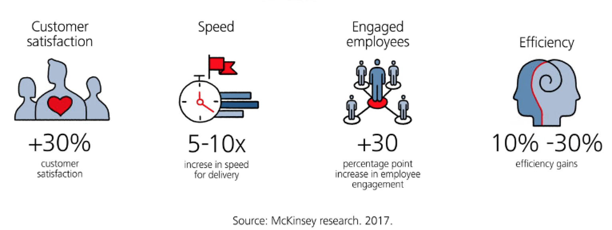
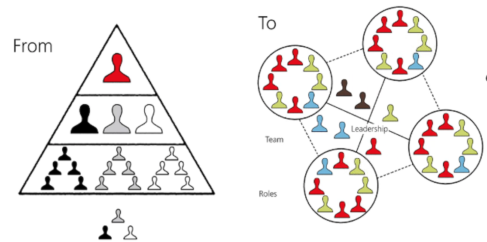
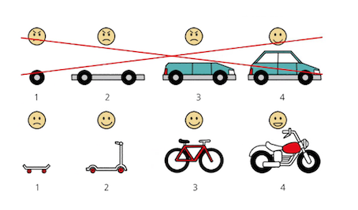
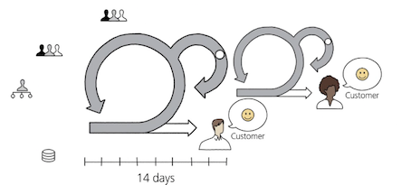
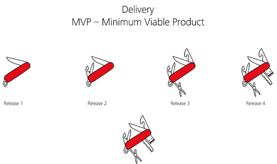
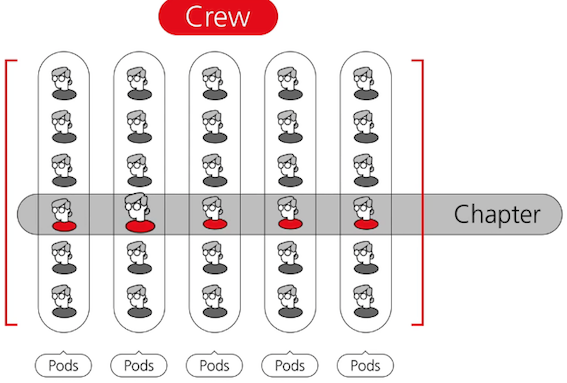

# **1 Agile Intro**

* Removing friction and dependencies
* Creating small, self-managing teams that work autonomously, with clear ownership and common objectives
* Delivering incremental business value earlier and often

**Creating small, self-managing teams that work autonomously, with clear ownership and common goals**

## **Iteration**

**Each iteration is a time-cycle of two weeks**, during which product backlog items are delivered by the pod. 

**Iterations are run consecutively with no gap between them.** 

We need to create an environment where we can safely learn from our smart failures to improve our products, processes and people. 

Rather than chasing a **long list of individual milestones and KPIs**, **agile pods follow common goals and measurable outcomes**, using **Objectives**
and **Key Results, or OKRs**.

**To improve delivery, agile aims to create a "Minimum Viable Product" MVP**

The first workable version is shared with the client, to enable capture of unique feedback and insights.

These insights give a higher level of predictability,so that changes can be flexibly implemented and problems can be solved before their impact is too big. 

**1 From hierarchy…..to enablement**

We need managers to move from being masterminds and micromanagers to being servant leaders - that means
leaders that clearly communicate the vision while coaching, supporting and empowering the team to self-manage so that they can achieve this vision.

**2 From measuring tasks and output..to outcome and impact**

* We need to move away from focusing solely on tasks, to outcome and impact; 
* solving customer problems and changing behavior, which will, in turn, have a positive impact on UBS.

**3 From silos….to cooperation**

Rather than only optimizing your own small teams and
"me" thinking, we would liketo collaborate more and think holistically on how we can benefit the whole
organization.

**4 From dispersed accountability..to team accountability**

We want pods to own problems end-to-end and solve them, not push the problem somewhere else.

**Crews (POD + POD + POD + POD)**

Agile also means making quick decisions, learning fast, being client-centric and continuously improving. It's about trusting and enabling teams and making them accountable. 

### **Key Takeaways**

* **Centralized to do list** 
	* Organize work in one repository which the whole **team can access**.

* **Worker in iterations**
	* A key feature of agile is the adaptive approach where refining the design over time is more effective 
	* Prioritize work and use time boxes.

* **Colaborate across function**
	* Drop the barriers between silos resulting in efficiency. Remember teams are more effective than individuals.

* **Transparency is key**

Make the work visible: 

* increasing collaboration andtransparency. 
* If it is important, write it down and share across stakeholders.

* **Feedback**

Looks for early feedback, inspect & adapt
(retrospective meeting), learn from your mistakes

* **Learn fast nd fail fast**

Learn from our past, front load the risk, and discover potential barriers early.

* **Run effective & efficient meetings**

Have a clear meeting agenda and follow up actions. Reduce big committee sessions. 

* **Communicate**

**Avoid unnecessary hand-offs communicate directly, eliminate the middle-men**

