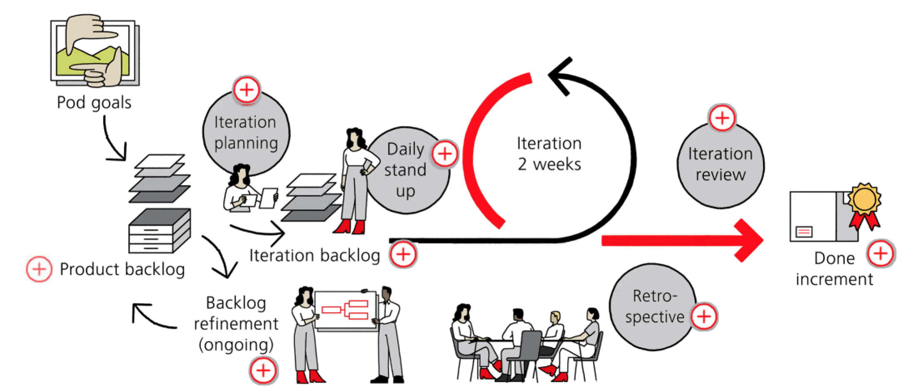
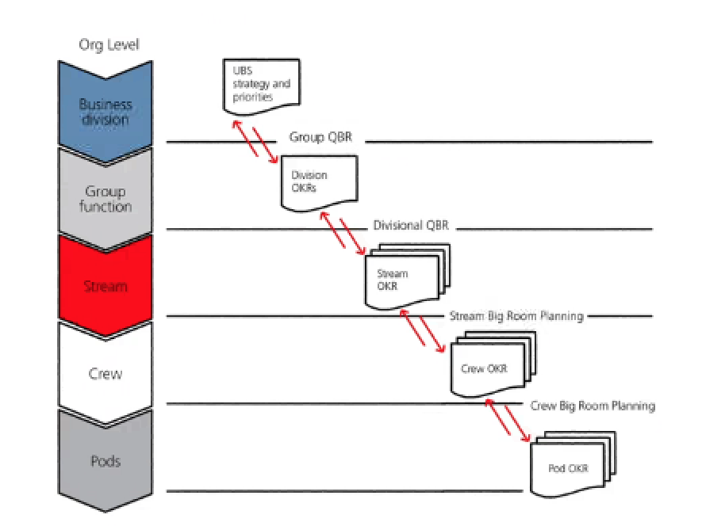

# **Agile Block Learn**

## **1 UBS Agile team components**

* Pod(Scrum Master + Project Owner + Projetc Member)
* **Crew**(POD + POD + POD)
* Same role in each pod => **Chapter**
* **Streams** are collections of crews that work together on a common goal based on client needs.
* **Streams (Stream technical lead + Stream product lead)**
	* **Stream product lead**
		* This role is to define the strategy, vision and quarterly OKRs for the stream.
	* **Stream technical lead**
		* Ensures the product is delivered and synced across a stream's platform

### **Product owner**

* Single dedicated person to prioritize the pod's efforts
* Understand the needs of the clients and stakeholders
* **Set goals (OKs) collaboratively with the pod members**

## **2 Agile ceremonies**

Pods work in short, rapid phases, called **iterations**.

These **iterations** last for no **more than two weeks**, and **new items are delivered throughout.**

### **1 Iteration planning**

* The first is iteration planning, a ceremony attended by **all pod members**, and sometimes **subject matter experts (SMEs) and stakeholders**.
* They will review the ordered backlog by value, do capacity planning and commit to the **iteration goal**. The work done in the backlog is called **product backlog items (BI) or stories**.

### **2 Backlog refinement ceremony**

Each iteration will **have at least one backlog refinement ceremony**, with more if required. To discuss **the content, scope and estimation of the highest ranked product backlog items**,

### **3 iteration review**

After working hard throughout the two weeks, the iteration is over, and it is finally time for the iteration review. 

**Discuss feedback and create new product backlog items to drive the product forward.**

### **4 Retrospective**

The retrospective together with the pod, to **reflect on how they worked together during this iteration**

* **1 Iteration planning**
	* **Objective: Pod alignment on the deliverables of the iteration** 
	* Potentially SMEs and other stakeholders if needed
	* Product owner & All Pod members

* **2 Backlog refinement**
	* **Objective**: 
		* **Ensure stories or product backlog items are
for iteration planning**.
		* Product backlog items and identify
* **3 Iteration review**
	* To demonstrate completed deliverables and
working items
	* Invite * from stakeholders
* **4 Retrospective ceremony**
	* Reflect on the success of the iteration, considering people, processes and tools. **Identify improvements and review metrics.**

	
### **One day each quarter**

This is for **the crew to set goals, OKRs and backlog for the next quarter alignment with other pods** Present the business context and goals following the UBS Quarterly Business Review (QBR).

Together, the whole crew, **crew product lead, product owners, and other stakeholders** align their understanding of goals and identify dependencies related to executing the product roadmap, And come up with a plan for the next quarter.

### **Retrospective**

crew retrospective ceremonies are held 3 times a quarter.

* **Crew big room planning**
	* Present objective and outcome for the quarter
	* Identify dependencies related to executing the product roadmap

* **Product owner sync**
	* Weekly conversation to Identify inter-pod dependencies
	* Ensure pod backlog aligns with Product Roadmap &
Crew OKR

* **POCLAC**
	* Align on highest priority areas to improve
	* Get feedback on pod performance

* **Crew review**
	* **Review recent iteration with stakeholder**
	* Give pods shared understanding of each other's
work

* **Crew retrospective**
	* Discuss opportunities and challenges of last month
	* Identify top actionable items for next quarter 

### **The iteration workflow**

* **Product backlog**

**The product backlog is a pipeline of future work**. 

Most detailed user stories are on the top and more vague ones below. Items which contribute to achieving the iteration goal are pulled by the pod members into the iteration backlog and are implemented during the iteration.

* **Iteration planning**

This happens at the start of the iteration. The purpose is for pod members to agree to the iteration goal and determine three things:

> Why: the purpose of the iteration
> 
> What: prioritized backlog items
> 
> How: plan implementation

* **Backlog refinement**

Backlog refinement can occur more than once during an iteration.

This is to ensure there are backlog items for the next 1 to 2 iterations.

* **Daily stand up**

These 15-minute meetings are for the pod members to briefly and concisely **inspect their progress towards the iteration goal, take corrective measures to reach it**. **identify and remove any impediments and help each other out**.

* **Iteration backlog**

The iteration backlog is the total amount of product **backlog items or stories that a team can finish within one iteration**.

* **Iteration review**

For the pod to assess the outcome of the iteration and decide upon any required adaptations going forward. 

During this stage, **results are also presented to stakeholders for approval and feedback**

* **Retrospective**

**This allows the pod to reflect on the iteration to ensure lessons are learned and opportunities to increase quality and effectiveness are identified**

The pod may discuss what went well and what could be improved

* **Done increment**

The product backlog items completed during an iteration.

## **3 Refining the backlog**

Let's talk about the refining (i.e. prioritizing and breaking down) the product backlog! 

### **product backlog**

**The product backlog is a list of all the items that the pod members could work on**.

**The product owner**, to prioritize the highest business value items, to ensure the pod is working on the right things.

* Those committed to for the next iteration, which are called the iteration backlog items planned for upcoming iterations, **and items that are either too big to pull into an iteration, or where further details are needed.**
* For a two week iteration, **stories are expected to be about two days in length**.

The product backlog comprises three main types of items:

* **Cards** 
	* who As a (user role)
	* what I want (action)
	* why so that (benefit)

* **Conversation**.
	* **The user story is written based on conversations between the product owner**, and the pod around the need of the dient and a potential solution.
	* The conversation helps to **ensure that the pod understands why the story is valuable,** gets their questions answered, and can discuss any technical concerns.
	* Sometimes during this **conversation stories will be further refined and broken down with additional details**.

* **Confirmation**
	* Each user storv must have **accentance criterias** that is defined and agreed by the product owner and pod
	* The next step would be for the pod members to estimate as a team how much effort it will take

### **Definition of ready (DOR)**

If the story meets the definition of ready, it can potentially go into the iteration backlog

### **User Story**

**The INVEST model**

* **Independent** - The story can stand alone
Negotiable - It can be changed or removed without
impacting other stories
* **Valuable** - It provides value for the end user
* **Estimable** - The size of the story can be estimated
* **Small** - It can be completed in one iteration
* **Testable** - It can be tested and verified

## **4 OKRs and QBRs on the pod and crew level**

### **QBR and OKRs**

Every quarter, **Quarterly Business Review (QBR)** to check the organization's objective against progress

**OKR are a collaborative goal-settine tool used by teams and individuals to set challenging goals with measurable results.**

OKRs should always be aligned top down, bottom up and across, and not cascaded from the top.

OKRs should be about the end results, that follow from
a preceding set of events and activities, not about tasks. So focus on the impact of the work done.

### **A vision statement**

* Sets a standard of excellence
* Clarifies direction and purpose
* Inspires enthusiasm and commitment
* Bridges the present and future
* Is clear and easy to understand

### Key rights

**Objectives** must be broken down to **key result**s to show we are on the right track. Don't get carried away-keep it to **3 to 5 objectives** and **2 to 3 key results** so there is focus.

Key result:

* Outcome-focuseds
* Measurable
* Trackable

### KPIs

show the overall health of a team, but they don't **demonstrate how close they are to reaching the goal**.

## **5 Quality on the pod and crew level**

### **Definition of Done**

This is a team understanding of what we mean by done to help set expectations, Similar to the definition of read. the definition of done can evolve over time.

