# **1 云原生网关**

## **网关基本概念**

在微服务架构里，服务的粒度被进一步细分，各个业务服务可以被独立的设计、开发、测试、部署和管理。

这时各个独立部署单元可以用不同的开发测试团队维护，可以使用不同的编程语言和技术平台进行设计，这就要求必须使用一种语言和平台无关的服务协议作为各个单元间的通讯方式。

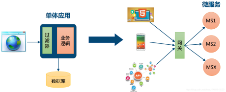

**网关的角色是作为一个 API 架构，用来保护、增强和控制对于 API 服务的访问。**

API 网关是一个处于应用程序或服务（提供 REST API 接口服务）**之前的系统，用来管理授权、访问控制和流量限制等**，这样 REST API 接口服务就被 API 网关保护起来，对所有的调用者透明。

**因此隐藏在 API 网关后面的业务系统就可以专注于创建和管理服务，而不用去处理这些策略性的基础设施**。

**API 网关是位于客户端和后端服务之间的 API 管理工具**，一种将客户端接口与后端实现分离的方式，在微服务中得到了广泛的应用。

当客户端发出请求时，API 网关会将其分解为多个请求，然后将它们路由到正确的位置，生成响应，并跟踪所有内容。

**API 网关可看做微服务架构体系中的一类型特殊服务，它是所有微服务的入口，它的职责是执行路由请求、协议转换、聚合数据、认证、限流、熔断等。**

**大多数企业 API 都是通过 API 网关部署的。API 网关通常会处理跨 API 服务系统的常见任务，例如用户身份验证、速率限制和统计信息**。

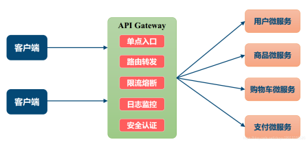

对于具体的后端业务应用或者是服务和业务有一定关联性的**策略网关就是业务网关**。 

**业务网关针对具体的业务需要提供特定的流控策略、缓存策略、鉴权认证策略等等**。

与业务网关相反，定义全局性的、跟具体的后端业务应用和服务完全无关的策略网关是流量网关。

流量网关通常只专注于全局的Api管理策略，比如全局流量监控、日志记录、全局限流、黑白名单控制、接入请求到业务系统的负载均衡等，有点类似防火墙。

## **云原生网关作用和规范**

随着容器化技术和云原生应用的普及，面临Kubernetes 集群内的网络环境与外部隔离， Kubernetes 集群外部的客户端无法直接访问到集群内部的服务的问题，需要解决不同网络域如何连接的问题。

解决跨网络域访问的常规做法是为目标集群引入一个入口点，所有外部请求目标集群的流量必须访问这个入口点，然后由入口点将外部请求转发至目标节点。

同样，Kubernetes 社区也是通过增设入口点的方案来解决集群内部服务如何对外暴露的问题。

Kubernetes 一贯的作风是通过定义标准来解决同一类问题，在解决集群对外流量管理的问题也不例外。

Kubernetes 对集群入口点进行了进一步的统一抽象，提出了 3 种解决方案：NodePort、LoadBalancer 和 Ingress。下图是这三种方案的对比：

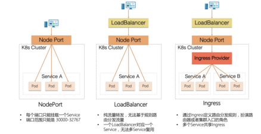

通过对比可以发现，NodePort 和 LoadBalancer 主要工作在四层流量上，只能用于暴露集群中一个服务。

当集群中对外暴露的服务数量增多时，NodePort 方案最终会因端口耗尽而无法暴露更多的服务，**而 LoadBalancer 方案则会引入同等数量的 SLB，在增加成本的同时也给运维增加负担**。

**定位在七层流量上的 Ingress 方案可以通过定义基于虚拟主机域和路径的路由规则来完成对集群中服务的代理，Ingress 与后端服务是一对多的关系，有效的降低了机器成本。**

此外，**因为外部访问集群中服务的所有入口流量都先经过共享的 Ingress Provider 节点，所以集群管理者可以在 Ingress Provider 中额外实施访问控制策略来保证集群中服务的安全性和稳定性，并且可以通过采集监控指标、记录访问日志以及开启链路追踪来增强可观测建设**。

因此目前 Ingress 方案是主流的选择。

## **Ingress规范**

简单讲，Ingress是 Kubernetes 处理边缘入口流量的一种方式。由于 Kubernetes 集群内的服务都是虚拟网络，外部流量访问集群内部至少需要一个公网ip和端口映射。

**Ingress 是 Kubernetes 应对集群管理外部访问流量的场景抽象出来一个资源对象，用来描述集群外部如何访问集群内部服务的方式。**

上文所述Kubernetes 有多种暴露边缘接口的方式，**相比而言ingress 通过暴露有限的公网 ip，使用反向代理的方式，无疑是一种更加有竞争力的方式**。

**说到反向代理，我们也可以直接搭建一个 Nginx 来做反向代理，但是要在 Nginx 里同步 Kubernetes 中随时可变的服务状态，明显增加了维护难度**。

好在 Kubernetes 官方提供并维护了一个 nginx ingress controller，帮助我们解决了反向代理的事情，有了这个 nginx ingress controller，可以帮助我们代理所有想要访问 Kubernetes 的外部流量，并且将流量正确的指向后端服务。

**通过 Ingress 资源来配置不同的转发规则，从而达到根据不同的规则设置外部访问集群内不同的 Service 所对应的后端 Pod。**

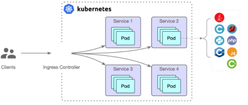

Ingress Controller是真实存在的工作负载节点，是真正意义上 Ingress 规则的实现者与执行者。

Kubernetes 提出 Ingress 的规范，将 Ingress 具体实现方式交给各种 Provider 以及云提供商，有效保证了 Ingress 不会被具体的 Provider 或者云厂商绑定，符合 Kubernetes 一直秉承的开放、标准的思想。

在云原生技术浪潮下，Ingress Provider 产品种类如雨后春笋般涌现，其中用户知名度最高当属 Kubernetes Nginx Ingress。

Nginx Ingress Controller 是由 Kubernetes 官方维护的，内部由 Controller 和数据面 Nginx 组成。

**Nginx Ingress Controller 由用户部署在 Kubernetes 集群中，通过访问集群的 API Server 来实时监听用户应用到集群中的 Ingress 资源，经 Controller 解析并转化为 Nginx 配置文件（nginx.conf)，然后通过 reload 数据面 Nginx 的方式使得配置生效**。

当外部请求访问集群入口点 Nginx Ingress Controller 时，匹配 Nginx Ingress 转发规则的流量转发到后端 Service 所对应的 Pod，由 Pod 处理外部请求。

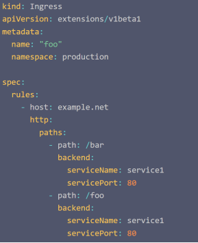

通过基于名称的虚拟主机支持，可以将针对多个服务的 HTTP 流量路由到同一 IP 地址上。

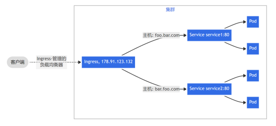

## **Gateway API规范**

在 Kubernetes 集群边缘对外提供网络服务的时候，通常需要借助 Ingress 对象，这个对象提供了暴露 Service 所必须的核心要素，例如基于主机名的路由、对 URL 路径的适配以及 TLS 配置等。

但是在实际开放服务的时候，往往会有更多的具体需求，这时 Ingress 对象所提供的核心功能就有些力不从心了。

各种 Ingress 控制器往往会使用 metadata.annotations 中的特定注解，来完成对 Ingress 特定行为的控制，完成各自的个性化功能，**例如认证、路径变更、黑白名单等**，这就让 Ingress 对象变成了一个奇怪的东西：**结构化的核心结构，和非结构化的标注结合起来形成各种 Ingress 方言**。

K8s 官方SIG-Network工作组基于实际现状和需求，提出了全新的 Gateway API 来作为 Ingress 的继任者。总体来说，相对于 Ingress，Gateway API 有几个显著特点：

职责分离，运维、开发等不同的角色都能够在适合的边界内完成工作；扩展核心能力，并使用更结构化的方式进行表达；

易于扩展，Gateway API 为各种不同实现的控制器提供了一致的扩展方法。

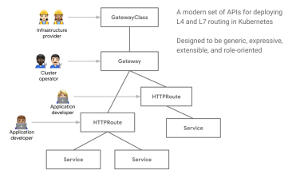

Gateway API 包含了三层概念：**GatewayClass、Gateway 和 Route，其中的 Route 实际是包含了 HTTPRoute、TCPRoute、TLSRoute 和 UDPRoute 在内的一组对象**。

GatewayClass是一个集群范围内的资源，由云基础设施中的 Gateway API 控制器提供，其职责和原有的 Ingress Controller 类似。

**<mark>Gateway 对象是命名空间范围对象，可以视作是 GatewayClass 的一个实例，它通常是由具体机群的运维人员进行维护的，在 Gateway 对象中可以指定该对象负责的主机名称范围，用标签选择器选择对应的 Service，甚至还可以指定该 Gateway 生效的命名空间</mark>**。

这样就给具体应用的对外开放划定了一个范围，防止应用随意占用主机名，并完善命名空间的隔离能力

Route 对象除了像原有的 Ingress 对象一样提供 HTTP 服务的开放能力之外，还提供了 TCP、TLS 和 UDP 的对应资源，**从而缓解了 Nginx、HAProxy Ingress 控制器使用 Configmap 配置 TCP/UDP 的窘境**。

HTTPRoute 除了提供基础的 Ingress 对象能力之外，还提供了一些扩展的功能，例如对流量进行复制、分流；**更重要的是其中还提供了 Filter 能力，这是一个扩展点，除了自带的核心处理能力之外，底层设施还可以在这里接入自己的 CRD，对流量进行处理，从而为流量处理能力的扩展提供了一个统一入口。**

值得注意的是，当前Gateway API规范还在快速发展和完善中。

## **云原生网关选型**

标准Nginx ingress controller 帮助维护了 Kubernetes 集群与 Nginx 的状态同步，并且提供了基本的反向代理能力，为什么还要自己造轮子呢? 

随着云原生技术持续演进，云原生应用微服务化不断深入，Nginx Ingress 在面对复杂路由规则配置、支持多种应用层协议（Dubbo 和 QUIC 等）、服务访问的安全性以及流量的可观测性等问题上略显疲惫。

在使用 Kubernetes 原生 ingress controller 之后，以下几点比较突出的问题:

1、**reload 问题：Kubernetes 原生 ingress 在设计上，将 YAML 配置文件交由 ingress controller 处理，转换为 nginx.conf，再触发 reload nginx.conf 使配置生效**。日常运维免不了修改 ingress 配置，每一次配置生效，都会触发一次 reload，这是不能接受的，尤其在边缘流量采用⻓连接时，更容易导致事故。

2、**在 annotation 中写脚本、填充参数：原生 ingress controller 支持在 yaml 中 annotation 定义脚本片段，感觉是为了支持高级功能而实现的一个临时方案，不好管理**。大量的 annotation 脚本给配置人员带来困扰。

3、**缺少对有状态负载均衡的支持：高级的负载均衡策略并没有支持**，比如 session persistent 等。

4、**动态调整权重：业务服务常常需要按照百分比控制流量，这在 Kubernetes 中却变成了麻烦**。虽然 Kubernetes 在1.8之后支持了 ipvs，无论是 kube-proxy 的启动参数，还是 kube-route 的 annotation，在使用上都不容易上手。

5、**扩展能力薄弱**：虽然 ingress 设计之初为了解决边缘流量，但人们对于边缘流量的需求一点都不比内部流量少。业务级灰度控制、熔断、流量控制、鉴权、流量管控等需求在 ingress 上实现的呼声更高。然而原生 ingress 提供的扩展此时却捉襟⻅肘。

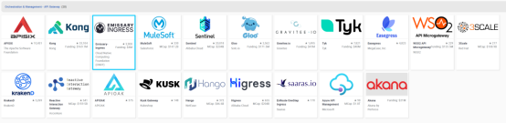

云原生网关选型需要综合考虑以下方面：是否开源，以及开源版本的功能和商业版区别，以及是否有特定公司主导还是社区整体主导。支持的服务发现规范也是重要的考虑因素。底层代理的实现方式是重要考虑因素，当前主要有Nginx内核，Envoy内核和Go语言自主开发实现几种方式，内核实现方式直接影响网关性能和可扩展性。另外，流量治理的功能丰富性和命名空间隔离能力也是考虑的重要因素。

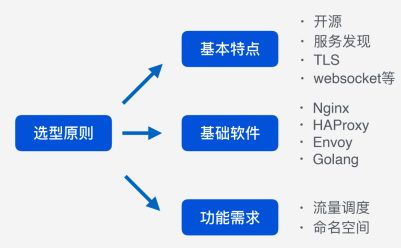

下图是几种当前主流网关的各项指标对比。

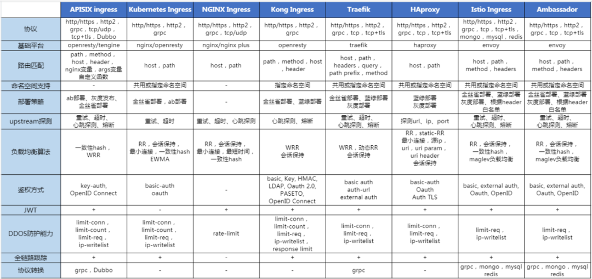

需要说明的是**Istio内置的Istio网关，对于策略控制、流量管理和流量监控可以直接通过 Istio 网关来完成，这样做的好处是通过 Istio 的控制平面来直接管理网关**，而不需要再借助其他工具。

但是对于 API 生命周期管理、复杂的计费、协议转换和认证等功能，成熟的 API 网关如Kong和Apisix可能更适合。

Apache APISIX 支持热配置，随时可以定义和修改路由，而且不会触发 nginx reload。在Apache APISIX中，可以通过插件代码编写逻辑，暴露出简单的配置接口，方便配置的维护，避免脚本对配置人员的干扰。

基于 Apache APISIX 可以扩展出符合要求的高级负载均衡需求，**Apache APISIX 不仅原生支持了 session persistent 等负载均衡，同时还预留 balancer 阶段的扩展能力。Apache APISIX 内部抽象出 route、service、consumer、upstream、plugin 等主要对象，对调整路由权重这类操作天然支持，只需简单的修改upstream 下的 node weight 即可**。

APISIX 在扩展能力上提供了插件的支持，除了官方提供的插件之外，可以自定义开发满足自身业务特性的插件。

由于Envoy的复杂性，虽然该项目在世界各地的大型工程组织中取得了巨大的成功，但在较小和较简单的用例中，它只被轻度采用，在这些用例中，Nginx 和 HAProxy 仍占主导地位。

新的Envoy Gateway 项目的诞生为了进一步统一基于Envoy的云原生网关：提供一个简化的部署模型和API 层，旨在满足轻量级使用。

将现有的 CNCF API 网关项目（Contour 和 Emissary）合并为一个共同的核，基于Gateway API规范可以提供更好的用户体验，同时仍然允许供应商在 Envoy Proxy 和 Envoy Gateway 的基础上建立增值解决方案。

汇聚在单一的以 Envoy 为核心的 API 网关周围，将会减少围绕安全、控制平面技术细节和其他共同关切的重复工作。

允许供应商专注于在 Envoy Proxy 和 Envoy Gateway 的基础上以扩展、管理平面 UI 等形式分层提供增值功能。让更多的用户享受到 Envoy 的好处，无论组织的大小。更多的用户为更多的潜在客户提供了良性循环，为 Envoy 的核心项目提供了更多的支持，也为所有人提供了更好的整体体验。

整体看，当前基于Nginx内核的网关如Kong和Apisix由于功能丰富度和成熟度水平较高，可以较好的满足云原生网关的功能需求。长期看，基于Envoy的网关由于技术的新颖性，在动态配置管理，可扩展性，以及安全和可观测性方面的先进性，是未来的技术趋势。

工程师是 API 和 API 网关的使用者和开发者，工程师关注和参与的 API 网关项目，一定程度代表了技术的趋势。下图从 GitHub 代码贡献者的维度，选取了 4 个开源网关产品进行对比：Apache APISIX、Kong、EnvoyGateway和 Istio，可做参考。

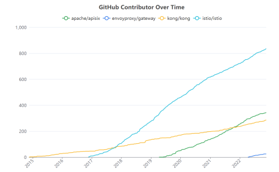

除了贡献者总数外，贡献者的月度活跃数也是重要参考指标。下图展示了以上四个开源 网关的月度活跃的开发者数量。可以看到各网关产品的开发活跃趋势。

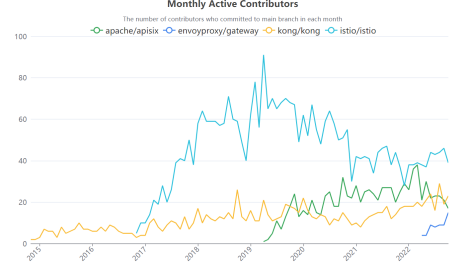
