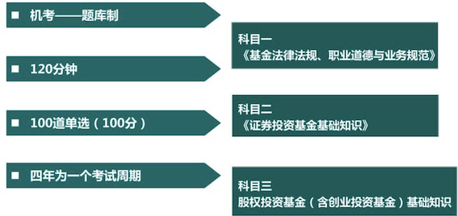

# **0 2022基金从业考试介绍 - 考试备课**

### **科目一《基金法律法规》**

* 第1章金融市场、资产管理与投资基金 
* 第2章证券投资基金概述 
* 第3章基金的类型 
* 第4章证券投资基金的监管 
* 第5章基金职业道德 
* 第16章基金的募集、交易与登记 
* 第20章基金的信息披露 
* 第21章基金客户和销售机构 
* 第22章基金销售行为规范及信息管理 
* 第23章基金客户服务 
* 第24章基金管理人公司治理和风险管理 
* 第25章基金管理人的内部控制 
* 第26章基金管理人的合规管理 

### **科目二 《证券投资基金基础知识》** 

* 第6章投资管理基础 
* 第7章权益投资 
* 第8章固定收益投资 
* 第9章衍生工具 
* 第10章另类投资 
* 第11章投资管理流程与投资者需求 
* 第12章投资组合管理 
* 第13章投资交易管理 
* 第14章投资风险管理 
* 第15章基金业绩评价 
* 第17章基金的投资交易与结算 
* 第18章基金的估值、费用与会计核算 
* 第19章基金的利润分配与税收 
* 第27章基金国际化的发展概况 

### **计算题分布**

**第六章**

* 资产、负债、所有者权益、收入、费用、利润
*  财报分析：流动（速动）比率、净资产收益率
*  货币时间价值：单利、复利、现值PV、终值FV
*  统计：中位数、均值

**第八章**

* 债券的**<mark>内在价值（价格）</mark>**
* 债券的收益率**<mark>（即期、必要、预期、到期）</mark>**

**第十二章**

预期收益率，方差，标准差，贝塔系数

**第十五章**

* 绝对收益 ．
* 相对收益：夏普、特雷诺、詹森等 
* 业绩归因模型 

**第十八章** 

基金资产净值、基金份额净值、基金费用 

### **基金科目二课程结构**

**基金投资管理**

* 第6章投资管理基础 
* 第7章权益投资 
* 第8章固定收益投资 
* 第9章衍生工具 
* 第10章另类投资 
* 第11章投资管理流程与投资者需求 
* 第12章投资组合管理 
* 第13章投资交易管理 
* 第14章投资风险管理 
* 第15章基金业绩评价 

**基金运作管理**

* 第17章基金的投资交易与结算 
* 第18章基金的估值、费用与会计核算 
* 第19章基金的利润分配与税收 

**基金国际化**

第27章基金国际化的发展概况 

### **考试形式**

## **考点示范：**

**远期合约**

**1.概念：**

交易双方约定在未来的某一确定的时间，按约定的价格买入或卖出一定数量某种合约标的资产的合约

* （1）对买卖**<mark>双方具有同等</mark>**的约束力
* （2）标的资产：**<mark>大宗商品、农产品</mark>**、外汇和利率等**<mark>金融工具</mark>**
* （3）金融远期合约：远期**<mark>利率</mark>**合约、远期**<mark>外汇</mark>**合约和远期**<mark>股票</mark>**合约

**2.特点**

* **<mark>非标准化</mark>**合约，一般**<mark>不在交易所交易</mark>**
* 没有统一的市场价格，市场**<mark>效率偏低；流动性比较差</mark>**
* 履约**<mark>没有保证，违约风险比较高</mark>**

**通常采用实物交割**

和期货合约相比，**比较灵活（最主要的优点）**

## **真题回顾**

1 关于远期合约的定义，以下描述错误的是（）

* **A．远期合约是一种标准化的合约**
* B．远期合约对买卖双方具有同等的约束力
* C．大宗商品和农产品可以作为远期合约的标的资产
* D．金融远期合约主要包括远期利率合约、远期外汇合约和远期股票合约

**【答案】A**

> **<mark>非标准化</mark>**合约，一般**<mark>不在交易所交易</mark>**

2 关于远期合约，错误的是（）

* **A．远期合约是一种标准化合约**
* B．远期合约不能形成统一的市场价格，与期货合约相比，市场效率偏低
* C．远期合约流动性通常较差
* D．远期合约是一种最简单的衍生品合约

**【答案】A**

> **<mark>非标准化</mark>**合约，一般**<mark>不在交易所交易</mark>**

相比期货，远期合约的市场效率偏低，原因是（）

* A．远期合约无法规避现货价格波动风险
* B．远期合约的理论价格经常与实际价格不相等
* **C．远期合约是一种非标准化的合约，没有固定交易场所**
* D．远期合约的标的资产通常为大宗商品和农产品以及外汇和利率等金融工具

**【答案】C**

远期合约和期货合约相比，最主要的优点是（）

* **A．远期合约相比而言比较灵活**
* B．远期合约的流动性比较好
* C．远期合约的违约风险比较低
* D．远期合约具有固定的交易场所

> 和期货合约相比，**比较灵活（最主要的优点）**

通常采用非标准形式、在场外进行交易的衍生品工具是（）

A．期货
B．期权
C．股票
**D．远期**

**【答案】D**