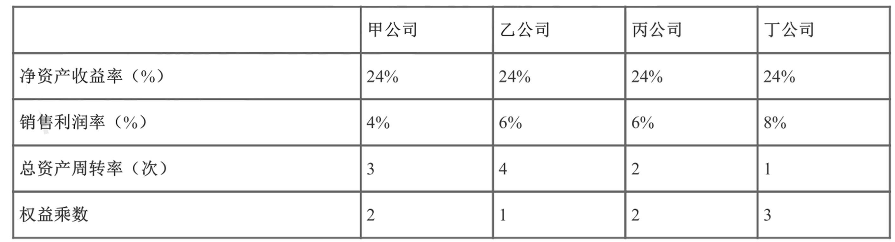

# **1 基金从业一证券投资基金基础知识**

## **01 投资管理基础（一）** 

### **第六章 投资管理基础** 

**开篇总述：三大财务报表**

* **资产负债表** 

基本逻辑关系：**资产=负债＋所有者权益（净资产、股权权益总额）** 

* **资产**：
	* **<mark>流动</mark>** 资产
	* **<mark>非流动</mark>** 资产

* **负债**：
	*   **<mark>流动</mark>** 负债
	*   **<mark>非流动</mark>** 负债

* **所有者权益**
	* **<mark>股本</mark>**（实收资本）
	* **<mark>基本公积</mark>**
	* **<mark>盈余公积</mark>**
	* **<mark>未分配利润</mark>**

* **利润表** 

* **利润表公式**：**<mark>收入-成本和费用＝利润（或盈余）</mark>**
* **现金流量表** 
	* **<mark>经营活动</mark>**产生的现金流量（CFO Cash flow from operating) 
	* **<mark>投资活动</mark>**产生的现金流量（CFI Cash flow from investing activities) 
	* **<mark>筹贷（融资）</mark>**活动产生的现金流量（CFF Cash from financing activities) 

**考点1：资产负债表**

* 基本逻辑关系：**<mark>资产＝负债＋所有者权益</mark>** 
* 含义：反映企业在**<mark>某一时点的资产、负债和所有者权益的状况</mark>** 
	* 报告时点：会计季末、半年末、年末 ・
* 基本作用
	* 列出企业占有资源的数量和性质
	* 表上的资源为分析**<mark>收入来源性质</mark>** 及**稳定性**提供基础 
	* 资产项：揭示企业**<mark>资金占用</mark>** 情况
	* 负债项：说明企业的**<mark>资金来源及财务状况</mark>**  

* 资产：企业所**<mark>拥有或控制</mark>** 的，以及被其他企业所欠的各种资源或财产 
	* **<mark>流动资产</mark>**：**货币资金、应收账款、应收票据、存货**（流动资产中**<mark>存货流动性最差</mark>**）等 
	* **<mark>非流动资产</mark>**：固定资产、**<mark>无形资产、长期股权投资、长期待摊费用</mark>**等 

* 负债：企业所应支付的所有的**<mark>债务 </mark>**
	* 流动负债：**<mark>短期</mark>**借款、**<mark>应付</mark>**账款、**<mark>应付票据</mark>**等 
	* 非流动负债：长期借款、**应付债券**等 

	
* 所有者权益（股东权益或净资产）：是清偿各种债务后，**<mark>企业股东所拥有的资产价值</mark>**
	* 股本（**<mark>实业资本</mark>**）：按**<mark>面值</mark>**计算的股本金 
	* 资本公积：<mark>股票发行**溢价**、法定财产重估**增值**、接受**捐赠**资产、政府**专项拨款**转入等</mark> 
	* 盈余公积：**法定**盈余公积和**任意**盈余公积 
	* 未分配利润：留待**以后年度分配**的利润或**待分配**利润 

**真题回顾** 

F公司2016年度资产负债表中，流动负债总计10亿元，非流动负债总计3亿元，所有者权益22亿元，则当年F 公司的总资产是（）。

A.13亿元   B.9亿元    **C.35亿元**    D. 22亿元     **<mark>[答案]  C</mark>**

> 资产=负债＋所有者权益（净资产、股权权益总额）
> 
>  10 + 3  + 22 =  35
> 
> 总资产=负债＋所有者权益=流动负债＋非流动负债＋所有者权益＝10+3 + 22= 35亿元

关于公司资产负债表，以下表述正确的是（）

* **A．负债项可以说明企业的资金来源和负债情况**
* B．如果总负债小于所有者权益，说明公司己经资不抵债  (小于负债)
* C．利润表是资产负债表的重要组成部分  (两者同等地位）
* D．总资产越大的公司，盈利能力越强   (利润表)

**【答案】A**

>【解析】资产负债表中的资产项揭示企业资金占用情况，负债项说明企业资金来源和财务状况，故A正确；
>
> 如果资产小于负债，说明企业已经资不抵债，故B错误；
> 
> 资产负债表和利润表是企业的两个重要财务报表，利润表反映企业的盈利能力，故C、D错误。 

## **第02 讲投资管理基础（二）**

### **考点2：利润表** 

* 含义（ **<mark>损益表</mark>**）：反映 **<mark>_一定时期_</mark>**的总体**<mark>经营成果</mark>**，揭示企业财务状况发生变动的 **<mark>直接原因</mark>** 
	* 评价企业的整体业绩和经营绩效 ・

* 构成
	* 营业**收入**，与营业收入**相关的**生产性费用、销售费用和其他**费用，利润** 

* 基本结构：**<mark>_收入 - 成本和费用＝利润_</mark>**（或盈余） 
	* **<mark>_营业收入 - 营业成本_</mark>**、销售费用、管理费用、**<mark>_财务费用_</mark>**等＝营业利润
	* 营业利润＋营业外收入（如：投资收益）- **<mark>_营业外支出_</mark>**＝利润总额
	* 利润总额 一 所得 **<mark>_税费用_</mark>**＝净利润 .

* 注：**<mark>_零利润_</mark>**重点应用于评价企业整体业绩 
	* **<mark>_净利润＝息税前利润 - 利息费用 - 税费_</mark>**

关于利润表，以下表述**错误**的是（）

* A．利润表可分析**<mark>_企业偿还长短期债务_的能力</mark>**   （**资产负债表**）
* B．利润表是一个动态报告  （**时期：1.1-2.1**）（资产负债表 -> 时点）
* C．利润表可解析企业获利能力高低的原因 
* D．利润表可分析企业控制成本费用支出的能力 

> 资产负债

* 【答案】A 
* 【解析】**资产负债表可以分析企业偿还长短期债务的能力**。 

### **考点3：现金流量表**

* 含义：特定**<mark>_会计_</mark>期间**内，企业的**<mark>_现金及现会等价物的增减变动_</mark>**等；以**<mark>_收付实现制_</mark>**为基础编制 

> 期间  -> 流量
> 
> 权责发生  + 收付实现

* 作用 
	* **<mark>_反映企业的现金流量_</mark>**，评价企业现金**<mark>_来源及去向_</mark>** 
	* 评价企业**<mark>_获取现金_</mark>**的能力、**<mark>_创造现金流量_</mark>**的能力、**<mark>_偿债能力和支付股利的能力_</mark>** 
	*  **<mark>_分析_</mark>**净收益与现金流量间的**<mark>_差显_</mark>**，并解释差异产生的原因 
* 净现金流 **<mark>_NCF=CFO+CFI+CFF_</mark>** 
	* **<mark>_期末_</mark>** 现金余额＝**<mark>_期初_</mark>** 现金余额＋**<mark>_当期净现金流_</mark>**  .

* **<mark>_若涉及外汇，则NCF =CFO+ CFI +CFF＋外汇变动影响_</mark>**  
* 基本结构 
	
	
* **<mark>经营活动_</mark>**  产生的现金流量（CFO) 
		* 流入：**_销售_**商品、提供劳务收到的现金 
		* 流出：**_购买_**商品、**_支付_**给职工的现金、**_支付的税费 _**

* **_投资_**活动产生的现金流量（CFI)，**_长期资产_**
	* 流入：取得**_投资业益_**
	* 流出：**_构建_**资产

* **_筹资(或融资_**)活动产生的现金流量（CFF) 
	* **_长期资本_**（股票、债券、贷款）筹集资金 
	* 流入：取得**_借款_**（如发行债券） 
	* 流出：**_偿还_**债务、**_分配股利_**或利润、**_偿付_**利息 

### **真题回顾**

通常情况下，企业现金流量表的基本结构可以分为（）。

* A．现金流入、现金流出、净现金流 
* B．资产、负债、所有者权益 
* **C．经营活动产生的现金流量、投资活动产生的现金流量、筹资活动产生的现金流量** 
* D．收入、费用、净利润 

> 净现金流 **<mark>_NCF=CFO+CFI+CFF_</mark>** 

* 【答案】C 
* ［解析］现金流量表的基本结构分为经营活动、投资活动和筹资（也称融资）活动产生的现金流量。 

某房地产企业预售商品住宅，开盘当日即收到一亿元现金，商品住宅明年交付，预售活动对该企业报表的影响是（）。 

* I．资产增加					II．负债增加 
* III．权益增加				IV．经营性现金流增加 
* V．净利润增加 

**I．资产增加 II．负债增加 IV．经营性现金流增加** 

［解析］

* **房地产企业预收现金一亿元，资产和负债同时增加，所有者权益不变**；
* 因销售商品住宅预收一亿元现金， 属于经营性活动产生的现金流，所以经营性现金流增加；
* **预售时不确认收入、不结转经营成本，故不影响净利润**。 

## **03 讲投资管理基础（三）**

### **流动性比率（1）**

* 分析**_财务报表_**的作用
	* 评估企业经营状况，但**_不能_**直接改善企业经营状况
	* 挖掘相关财务信息，发现企业存在的问题或潜在投资机会
* 衡量企业的**_<mark>短期偿债能立</mark>_** 
	* **_现金_**比率、流动比率、**_<mark>流动比率</mark>_**  

	
### **流动性比率（2)**

* **流动比率**：**_<mark>流动比率=流动资产/流动负债</mark>_** 

* **速动比率**
	* **_速动_**比率 = （流动资产-**_<mark>存货</mark>_**）／流动负债
		* (3-1) / 1 = 2
		* (3-3) / 1 = 0
	* **速动比率总是不大于流动比率**
	* <mark>`>1`时，**企业才能维持良好的短期偿债能力和财务稳定状况</mark>**
		
* 流动资产**_<mark>内部</mark>_**转换，**_<mark>不改变</mark>_**流动比率，**_<mark>可能改变</mark>_**速动比率 ・
	* <mark>**现金购买存货**，流动资产**不变**，流动比率**不变**，**速动比率降低**</mark>
	* 存货上升，（流动资产-存货）降低

	

	
### 真题回顾

在其他因素不变的情况下，**当企业用现金购买存货时**，流动比率和速动比率分别（）。 

* **A．不变，降低**		B．降低，不变 
* C．不变，不变		D．降低，升高 

* 【答案】A 
	* 【解析】流动比率＝流动资产／流动负债；
	*  **速动比率 = （流动资产-存货）／流动负债**
	* **用现金购买存货，流动资产不变，流动比率不变；存货增加，速动比率变小**。 

### **考点5：财务杠杆比率**

* **<mark>资产负债率=负债／资产</mark>** 
* **<mark>负债权益比=负债／所有者权益（净资产）</mark>** 
* 权益乘数= 资产／所有者权益（净资产）
	* = **1/ (1一资产负债率）＝ 负债权益比＋1** 
	* = 资 / (净资产) = 资 / (资 - 负)

* **利息倍数，公式＝息税前利润（EBIT)／利息** 
	*  **<mark>长期债务</mark>**的利息支付义务 
	*  **<mark>指标越高，债权入越安全</mark>** 

总结： 

* **上述指标衡量企业的_<mark>长期</mark>_偿债能力**
* 上述前三个**<mark>指标数值越大</mark>**->财务杠杆比率越高->负债越重 

### **考点6:营运效率比率**

* 反映企业资产的**<mark>管理质量和利用利率</mark>** 
	* 存货**<mark>周转</mark>** 率；
	* (2）存货**<mark>周转</mark>** 天数 
	* (3）应收账款**<mark>周转</mark>** 率；
	* (4）应收账款**<mark>周转</mark>** 天数 
	* (5）总资产**<mark>周转</mark>** =**<mark>年销售收入／年均总资产</mark>** 

* 周转率**_越大_**，表示效皇越直 
* 周转天数＝365天／周转率，表示平均几天周转一次 
	* **<mark>总资产</mark>**周转天数=365天／总资产周转率
* **<mark>总资产</mark>**周转率＝**年销售收入／年均总资产** 
	* **越大**，说明资产利用效率**越高**

## **04 讲投资管理基础（四）**

### **考点7：盈利能力比率（1)**

* **<mark>销售利润率</mark>**= 净利润  /  销售收入 
* **<mark>资产收益率</mark>**=  净利润 / 总资产
	* 反映企业利用**<mark>资产</mark>**创造利润的能力 
	* 反映企业在**<mark>增加收入</mark>**和**<mark>节约资金使用</mark>**方面取得的效果 

*  **<mark>净资产收益率＝净利润 / 所有者权益</mark>** 
	* **所有者权益 （净资产）**
	* 衡量企业最大化**<mark>股东</mark>** 财富能力的比率 
	* 反映企业利用**<mark>自有资本</mark>** 获利的能力 

### **考点7：盈利能力比率（2)** 

* 杜邦分析法（**<mark>核心</mark>**比率：**<mark>净资产收益率</mark>**）
	* <mark>资产收益率＝销售利润率 * 总资产周转率</mark>
		*  **销售利润率 = 净利润  /  销售收入**
		* **总资产周转率 =   365天 / 总资产**
		* **总资产周转率 ＝ 年销售收入／年均总资产**
	* **资**产收益率 = **<mark>销售利润率 * 总资产周转率 * 权益乘数</mark>** 
		* **肖总有权确定**
		* （净利润 / 销售收入） * （年销售收入／年均总资产） * （资产／所有者权益（净资产））
	* 权益乘数（**<mark>财务杠杆</mark>**）= 总资产／所有者权益＝ **<mark>1/(1-资产负债率）</mark>** 
		* 资产负债率=负债／资产

### 真题回顾 

甲、乙、丙、丁四家公司2015年部分财务数据如下表：则四家公司中，**资产使用效率**最高的是（ ）。

**A．乙**   B．丁   C．甲   D．丙 

> 资产使用效率 =  总资产周转率
> 
> ［答案] A 【解析】
> 
> **总资产周转率越大，说明企业的销售能力越强，资产利用率越高，乙公司中使用效率最高**
> 
> **资产收益率 = 销售利润率 * 总资产周转率 * 权益乘数**
> 
>  24 = 4 * 3 * 2 

某企业的总资产为200亿元，销售收入为50亿元， 总负债为120亿元，**销售净利润率为30%**，那么它的**净利润**和**净资产收益率**为（）

* A. 30亿元和18.75% 
* B.15亿元和37.5% 
* C.30亿元和37.5% 
* D. 15亿元和18.75% 

* ［答案］D 
* 【解析】净利润=50x30%=15（亿元）; 

> 净利润 
> 
> 净资产收益率＝净利润 / 所有者权益(净资产）
> 
> 销售利润率 = 净利润 / 销售收入  30% = X / 50   X=15
> 
> 所有者权益＝资产-负债＝200-120=80（亿元）
> 
> 故净资产收益率＝15 / 80=18.75% 

### **总结**

* 三大财务报表
	* 资产负债表
	* 利润表
	* 现金流量表

* 偿债能立
	* 短期偿债能立
	* 长期偿债能力

* 营运效率
* 盈利能力

### **考点8：货币时间价值与利率（1）**

* 货币时间价值 
	* 货币**随时间推移**而发生的增值 
	* 货币时间价值**<mark>并不必然等于</mark>**存款利息 
	* 金额相等的资金在**_不同时期_**，其实际价值量也是**_不相等_**的 
	* 金额相等的资金**_持有时间长度相同_**，则增值量也**_可能不同_** 

* <mark>净现金流量：一段时间内现金流量的**_代数和_**</mark> 
	* 净现金流量＝现金流入-现金流出 

### **考点8：货币时间价值与利率（2)**

1．利率 

* 资金增值同投入资金的价值之比，衡量资金**增值量的基本单位** 

2.实际利率 = **名义利率-通货膨服率** 

* 通常所说的**年利率都是指名义利率** 
	* (1)名义利率：**<mark>包含对通货膨胀补偿的利率</mark>**
	* (2)实际利率：**扣除通货膨胀补偿**以后的利率，或购买力不变情况下的利率 

真题回顾 

名义利率为12%，通货膨胀率为-2%，则实际利率是（）。

 A. 24% 	B. 10% C. 14% D. 6% 

* ［答案］C 
* 【解析】**实际利率＝名义利率一通货膨胀率**＝12％ -（-2%) =14%。 

下面属于货币时间价值的应用的是（）。

* A．谷贱伤农 B．不要为洒掉的牛奶哭泣   **C．早收晚付**  D．卖的比买的精 

* ［答案] C 
* 【解析】“谷贱伤农”反映的是供给需求的不均衡；“不要为撒掉的牛奶哭泣”反映的是机会成本或者沉没成本；“卖的 比买的精”反映的是信息不对称，**“早收晚付”反应的是货币的时间价值**，故C正确。 

### **第05 讲投资管理基础（五）**

### **考点9：单利、复利、现值与终值（1)** 

* **单利**
	* **<mark>仅本金</mark>**产生利息，**<mark>利息不产生利息</mark>** 
	* **<mark>仅</mark>**考虑本金的时间价值，**<mark>不</mark>** 考虑利息的时间价值 

* **复利**
	* 每经过一个计息期，将**<mark>所生利息</mark>**加入本金**<mark>再计利息</mark>** 
	* **<mark>既</mark>**考虑本金的时间价值，**<mark>又</mark>**考虑利息的时间价值 
	* **<mark>多个</mark>**周期下，复利利息**<mark>大于</mark>**单利利息 

### **考点9：单利、复利、现值与终值（2)**

* 现值与终值 
	* 单利法计算（每一计息期**<mark>利息额相等</mark>** ） 
		* 终值 `FV= PV x (1+ i * n) `
		* 现值 `PV= FV/ (1 + i * n)` 
	* 复利法计算 

* **单利**
	* **10W  2.2%**
		* 1年： 10W + 10W * 2.2 % 
		* 2年： 10W + 10W * 2.2 % + 10W * 2.2 %
		* （终值）FV= （现值）PV x (1+ i * n)  
		* 10W * (1 + 2.2% * n) 

* **复利**
	* 终值 `FV = PV x (1 + i) '`  
		*  `' = n`
	* 现值 `PV = FV / (1 + i) '`  
		*  `' = n`
	* **i 表示利率；n 表示年限**

### **考点9：单利、复利、现值与终值（3)**

* **<mark>贴现</mark>**
	* 将**<mark>未来</mark>**某时点资金的价值**<mark>折算为</mark>**现在时点的价值 
* **<mark>贴现率</mark>** 
	* 计算**<mark>现值</mark>**的利率，通常用**<mark>名义利率</mark>**表示 
		* **贴现率：市场利率， 名义利率**
	* 贴现率**<mark>越高</mark>**，现值**<mark>越低</mark>**

* **<mark>贴现因子</mark>**  
	* **<mark>`1/(1+i) n`  或 `(1+i)   -n`,  用`（PV, i, n）`表示</mark>** 
	* n年后的FV求现值PV, **PV=FV * (PV, i, n) **
		*  (1 + i) -n 
	* **如果每年发生等额现金流M，则** 
	* PV = M * (PV, i, 1) + M *  (PV, i, 2) ...  + M *  (PV, i, n-1) + M *  (PV, i, n) 
		* 1年： 10W + 10W * 2.2 % 
		* 2年： （10W + 10W * 2.2 %） *（ 1 + 2.2 %）= 10w *  （ 1 + 2.2 %)²

