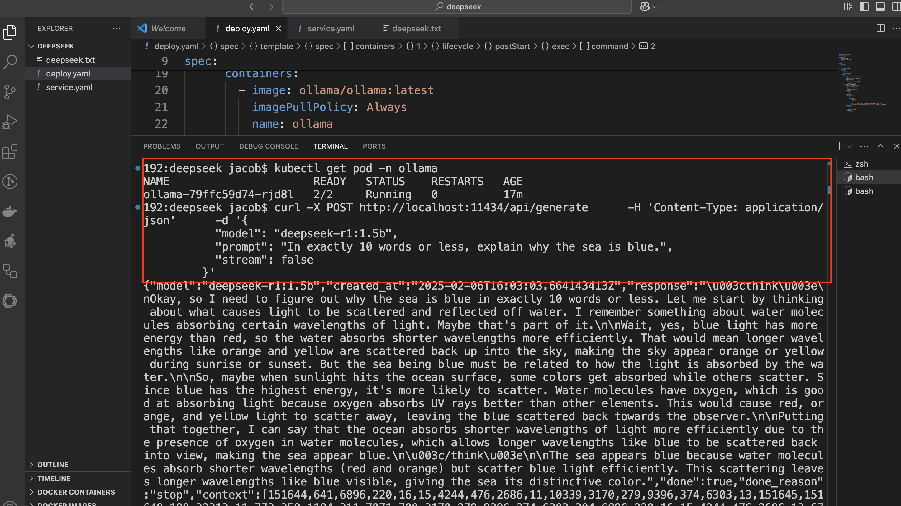

# 在 Kubernetes上免费部署Ollama+DeepSeek

## Ollama 和 Kubernetes 的结合优势

二者结合后，我们可以快速部署 Ollama 服务器，并通过 API 与 DeepSeek 模型进行交互。


**Ollama ：通过 REST API 简化了模型服务的部署和调用，支持多种机器学习模型。**

**Kubernetes ：提供灵活的扩展性和高可用性，适合部署复杂的模型服务。**


## 部署Ollama+ DeepSeek详细步骤：

为 Ollama 创建一个专用命名空间。

```
kubectl creat ns ollama
```

```
kubectl get ns | grep ollama
ollama            Active   22h
```

创建一个 `deploy.yaml` 文件，定义 Ollama 的部署和模型的加载逻辑：

```

apiVersion: apps/v1
kind: Deployment
metadata:
  name: ollama
  namespace: ollama
  labels:
    app: ollama
spec:
  replicas: 1
  selector:
    matchLabels:
      app: ollama
  template:
    metadata:
      labels:
        app: ollama
    spec:
      containers:
        - image: ollama/ollama:latest
          imagePullPolicy: IfNotPresent
          name: ollama
          ports:
            - containerPort: 11434
              protocol: TCP
        - name: load-model
          image: curlimages/curl
          imagePullPolicy: IfNotPresent
          args:
            - sleep infinity
          command:
            - /bin/sh
            - '-c'
          lifecycle:
            postStart:
              exec:
                command:
                  - /bin/sh
                  - '-c'
                  - >
                    curl -X POST http://localhost:11434/api/pull -H
                    'Content-Type: application/json' -d '{"name": "llama3.2"}'
          resources:
            limits:
              cpu: 25m
              memory: 50Mi
            requests:
              cpu: 25m
              memory: 50Mi
```

```
kubectl apply -f deploy.yaml

% kubectl get pod -n ollama
NAME                      READY   STATUS    RESTARTS      AGE
ollama-79ffc59d74-rjd8l   2/2     Running   2 (21h ago)   22h
```

### 暴露 Ollama API 服务

为了与 Ollama 的 REST API 交互，我们需要将服务暴露出来。可以选择使用 LoadBalancer、NodePort 或 ClusterIP 类型的服务。

以下是一个示例服务配置文件 service.yaml

```
apiVersion: v1
kind: Service
metadata:
  name: ollama
  namespace: ollama
  labels:
    app: ollama
spec:
  type: LoadBalancer
  ports:
  - port: 11434
    targetPort: 11434
    protocol: TCP
    name: http
  selector:
    app: ollama
```

与 Ollama + Deepseek 交互：

```
% kubectl get svc -n ollama 
NAME     TYPE           CLUSTER-IP        EXTERNAL-IP    PORT(S)           AGE
ollama   LoadBalancer   192.168.194.211   198.19.249.2   11434:30330/TCP   22h
```

### 与 Ollama + Deepseek 交互：


一旦 Ollama 部署完成，我们可以通过其 REST API 与模型交互。在之前的部署中，我们添加了load-model容器，用来与 Ollama 的API接口交互调用，我们进入容器内部，使用curl相关命令即可。'

a) 列出可用模型

**使用 GET 请求检索 Ollama 环境中所有可用模型的列表：**

```
% curl http://localhost:11434/api/tags | jq

  % Total    % Received % Xferd  Average Speed   Time    Time     Time  Current
                                 Dload  Upload   Total   Spent    Left  Speed
100   344  100   344    0     0  11075      0 --:--:-- --:--:-- --:--:-- 11096
{
  "models": [
    {
      "name": "llama3.2:latest",
      "model": "llama3.2:latest",
      "modified_at": "2025-02-07T14:01:25.492244029Z",
      "size": 2019393189,
      "digest": "a80c4f17acd55265feec403c7aef86be0c25983ab279d83f3bcd3abbcb5b8b72",
      "details": {
        "parent_model": "",
        "format": "gguf",
        "family": "llama",
        "families": [
          "llama"
        ],
        "parameter_size": "3.2B",
        "quantization_level": "Q4_K_M"
      }
    }
  ]
}
```

要下载并加载特定模型（例如，deepseek-r1:8b），发送 POST 请求到 `/api/pull`：

```
curl -X POST http://localhost:11434/api/pull \
     -H 'Content-Type: application/json' \
     -d '{
           "name": "deepseek-r1:1.5b"
         }'
```

```
{"status":"verifying sha256 digest"}
{"status":"writing manifest"}
{"status":"success"}
```

c) 使用DeepSeek模型

加载模型后，可以通过 /api/generate 接口与模型交互：

```
curl -X POST http://localhost:11434/api/generate \
     -H 'Content-Type: application/json' \
     -d '{
           "model": "deepseek-r1:1.5b",
           "prompt": "In exactly 10 words or less, explain why the sea is blue.",
           "stream": false
         }'
     
```

```
% curl http://localhost:11434/api/tags | jq     
  % Total    % Received % Xferd  Average Speed   Time    Time     Time  Current
                                 Dload  Upload   Total   Spent    Left  Speed
100   678  100   678    0     0  79428      0 --:--:-- --:--:-- --:--:-- 84750
{
  "models": [
    {
      "name": "deepseek-r1:1.5b",
      "model": "deepseek-r1:1.5b",
      "modified_at": "2025-02-07T15:21:52.361481421Z",
      "size": 1117322599,
      "digest": "a42b25d8c10a841bd24724309898ae851466696a7d7f3a0a408b895538ccbc96",
      "details": {
        "parent_model": "",
        "format": "gguf",
        "family": "qwen2",
        "families": [
          "qwen2"
        ],
        "parameter_size": "1.8B",
        "quantization_level": "Q4_K_M"
      }
    },
    {
      "name": "llama3.2:latest",
      "model": "llama3.2:latest",
      "modified_at": "2025-02-07T15:13:43.144599582Z",
      "size": 2019393189,
      "digest": "a80c4f17acd55265feec403c7aef86be0c25983ab279d83f3bcd3abbcb5b8b72",
      "details": {
        "parent_model": "",
        "format": "gguf",
        "family": "llama",
        "families": [
          "llama"
        ],
        "parameter_size": "3.2B",
        "quantization_level": "Q4_K_M"
      }
    }
  ]
}
```

示例返回结果：



```
% curl -X POST http://localhost:11434/api/generate \
     -H 'Content-Type: application/json' \
     -d '{
           "model": "deepseek-r1:1.5b",
           "prompt": "In exactly 10 words or less, explain why the sea is blue.",
           "stream": false
         }'
{"model":"deepseek-r1:1.5b","created_at":"2025-02-07T15:22:43.334125705Z","response":"\u003cthink\u003e\nOkay, so I'm trying to figure out why the sea is blue. From what I know, it's because of Rayleigh scattering, right? The sun emits a lot of light in all directions, but water molecules scatter some of that light when it hits them. Since blue light has shorter wavelengths, they're scattered more by the water molecules than red or other colors. That makes sense because the Sun is bright, so more light gets scattered.\n\nBut wait, I'm not entirely sure about all the details. Maybe there's something else causing the sea to be blue too. Like, do clouds affect it? I think when it's cloudy, you can see more of the sky, which might look blue because of the water's reflection or something. But does that make the entire sea appear blue?\n\nI'm also wondering about light diffusing in water. Does the light spread out so much that each part doesn't really catch up with the blue color? Maybe it just looks blue overall because of how the sky is colored.\n\nHmm, I think Rayleigh scattering is definitely a main reason for the sea being blue. But clouds might add more color to the sky or water. So putting it all together, the sea appears blue mainly due to Rayleigh scattering of sunlight by the water molecules, even though clouds can reflect some light that contributes to its color.\n\nI'm not sure if there are other factors, but I think Rayleigh scattering is the key here. Maybe with more particles in the air and more sunlight, it's easier for shorter wavelengths to scatter. So sea being blue is mostly about this phenomenon.\n\u003c/think\u003e\n\nThe sea appears blue primarily due to Rayleigh scattering of sunlight by water molecules. This occurs because shorter wavelengths (like blue) are scattered more effectively than longer ones (like red). Clouds can reflect some light contributing to the sky's color, but the main reason the sea appears blue is Rayleigh scattering, which is enhanced by factors such as a larger volume of water and more sunlight intensity.","done":true,"done_reason":"stop","context":[151644,641,6896,220,16,15,4244,476,2686,11,10339,3170,279,9396,374,6303,13,151645,151648,198,32313,11,773,358,2776,4460,311,7071,700,3170,279,9396,374,6303,13,5542,1128,358,1414,11,432,594,1576,315,13255,62969,71816,11,1290,30,576,7015,72780,264,2696,315,3100,304,678,17961,11,714,3015,34615,44477,1045,315,429,3100,979,432,12983,1105,13,8704,6303,3100,702,23327,92859,11,807,2299,36967,803,553,279,3015,34615,1091,2518,476,1008,7987,13,2938,3643,5530,1576,279,8059,374,9906,11,773,803,3100,5221,36967,382,3983,3783,11,358,2776,537,11368,2704,911,678,279,3565,13,10696,1052,594,2494,770,14381,279,9396,311,387,6303,2238,13,8909,11,653,29514,7802,432,30,358,1744,979,432,594,73549,11,498,646,1490,803,315,279,12884,11,892,2578,1401,6303,1576,315,279,3015,594,21844,476,2494,13,1988,1558,429,1281,279,4453,9396,4994,6303,1939,40,2776,1083,20293,911,3100,3638,970,304,3015,13,12553,279,3100,8865,700,773,1753,429,1817,949,3171,944,2167,2287,705,448,279,6303,1894,30,10696,432,1101,5868,6303,8084,1576,315,1246,279,12884,374,27197,382,80022,11,358,1744,13255,62969,71816,374,8491,264,1887,2874,369,279,9396,1660,6303,13,1988,29514,2578,912,803,1894,311,279,12884,476,3015,13,2055,10687,432,678,3786,11,279,9396,7952,6303,14576,4152,311,13255,62969,71816,315,39020,553,279,3015,34615,11,1496,3498,29514,646,8708,1045,3100,429,42972,311,1181,1894,382,40,2776,537,2704,421,1052,525,1008,9363,11,714,358,1744,13255,62969,71816,374,279,1376,1588,13,10696,448,803,18730,304,279,3720,323,803,39020,11,432,594,8661,369,23327,92859,311,44477,13,2055,9396,1660,6303,374,10008,911,419,24844,624,151649,271,785,9396,7952,6303,15503,4152,311,13255,62969,71816,315,39020,553,3015,34615,13,1096,13666,1576,23327,92859,320,4803,6303,8,525,36967,803,13444,1091,5021,6174,320,4803,2518,568,14817,82,646,8708,1045,3100,28720,311,279,12884,594,1894,11,714,279,1887,2874,279,9396,7952,6303,374,13255,62969,71816,11,892,374,23922,553,9363,1741,438,264,8131,8123,315,3015,323,803,39020,20612,13],"total_duration":17627171188,"load_duration":1094249415,"prompt_eval_count":19,"prompt_eval_duration":497000000,"eval_count":407,"eval_duration":16034000000}%  
```